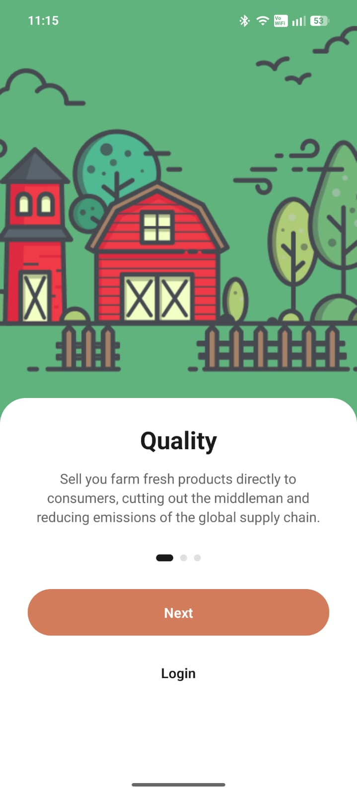
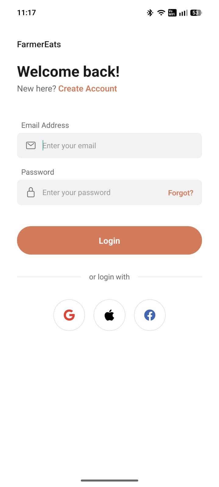

# Farmer Eats 🚜🌾 - Build Result

[](https://expo.dev/)
[](https://reactnative.dev/)
[](https://www.typescriptlang.org/)
[](https://opensource.org/licenses/MIT)

**Farmer Eats** is a premium, production-ready mobile application built using **Expo** and **React Native**. It features a modular architecture, comprehensive authentication flows, and a polished user interface designed for a seamless agricultural marketplace experience.

---

## 📲 Download & Demo

Get the latest version of the app directly on your Android device:

👉 [**Download APK (Android)**](https://expo.dev/accounts/okaady/projects/test/builds/68db1c80-095a-4aff-999e-4bccd4c1ad40)

*Note: This is a preview build generated via EAS.*

---

## 🎨 Visual Identity

<table align="center">
  <tr>
    <td align="center"><b>App Icon</b></td>
    <td align="center"><b>Splash Screen</b></td>
  </tr>
  <tr>
    <td align="center"></td>
    <td align="center"></td>
  </tr>
</table>

---

## 🎥 Demo Video

Watch the application in action:

<div align="center">
  <a href="https://drive.google.com/file/d/108pBFBgl6Fhm4-NhMQr8aIKg5j_fgV39/view?usp=sharing">
    
    <br />
    🎬 <b>Click here to view the Demo Video on Google Drive</b>
  </a>
</div>

---

> [!IMPORTANT]
> **Technical Note: Password Recovery Flow Availability**
>
> Please be advised that the backend endpoint for the Password Reset OTP service is currently not functional. Consequently, the accompanying demo video does not illustrate the transition to the OTP Verification and Password Reset screens.
>
> For developers or reviewers wishing to inspect these specific UI components, please follow these steps:
> 1. Navigate to [`hooks/auth-hooks.ts`](hooks/auth-hooks.ts).
> 2. Temporarily bypass the API call within the password recovery functions.
> 3. Implement a direct navigation command to the desired screens to view the protected UI layers without server-side verification.

---

## 📸 Screenshots

### 📝 Registration Flow (Signup)

<table align="center">
  <tr>
    <td align="center"><b>Step 1: Account</b></td>
    <td align="center"><b>Step 2: Business</b></td>
    <td align="center"><b>Step 3: Farm</b></td>
  </tr>
  <tr>
    <td align="center"></td>
    <td align="center"></td>
    <td align="center"></td>
  </tr>
</table>

<table align="center">
  <tr>
    <td align="center"><b>Step 4: Verification</b></td>
    <td align="center"><b>Step 5: Finalize</b></td>
  </tr>
  <tr>
    <td align="center"></td>
    <td align="center"></td>
  </tr>
</table>

### 🔐 Authentication & Access

<table align="center">
  <tr>
    <td align="center"><b>Onboarding</b></td>
    <td align="center"><b>Login Screen</b></td>
    <td align="center"><b>Login Success</b></td>
  </tr>
  <tr>
    <td align="center"></td>
    <td align="center"></td>
    <td align="center"></td>
  </tr>
</table>

### 🔑 Password Recovery Flow

<table align="center">
  <tr>
    <td align="center"><b>Forgot Password</b></td>
    <td align="center"><b>OTP Verification</b></td>
    <td align="center"><b>New Password</b></td>
  </tr>
  <tr>
    <td align="center"></td>
    <td align="center"></td>
    <td align="center"></td>
  </tr>
</table>


## ✨ Features

### 🔐 Comprehensive Authentication Flow
- **Onboarding**: Engaging multi-slide introduction to the platform.
- **Login / Signup**: Secure entry points with social login support (Google, Apple, Facebook).
- **OTP Verification**: Robust 5-digit code verification for account security.
- **Password Recovery**: Full "Forgot Password" and "Reset Password" workflows.
- **Multi-Step Signup**: Detailed user registration including business and farm information.

### 🏗️ Advanced Architecture
- **Feature-Based Module System**: Highly organized directory structure for maximum scalability.
- **Custom Hook Logic**: 
  - `useSignupForm`: Complex state management for multi-step registration.
  - `auth-hooks`: Consolidated logic for identity management.
- **Atomic Design Components**: Reusable `core` components like `AppButton`, `AppInput`, and `SocialLink`.
- **Navigation**: Next-generation file-based routing with **Expo Router**.

### 🎨 Design System
- **Custom UI Components**: Built from scratch for a unique brand identity.
- **Responsive Layouts**: Optimized for various screen sizes and orientations.
- **Dynamic Assets**: Premium icons and splash screens tailored for "Farmer Eats".

---

## 🛠️ Technical Stack

- **Framework**: [Expo 54](https://expo.dev/) (SDK 54)
- **Library**: [React Native 0.81](https://reactnative.dev/)
- **Language**: [TypeScript](https://www.typescriptlang.org/)
- **Routing**: [Expo Router v6](https://docs.expo.dev/router/introduction/)
- **Networking**: [Axios](https://axios-http.com/)
- **State & Logic**: TanStack Query & Custom React Hooks
- **Icons**: Expo Vector Icons & Custom SVG integration

---

## 📁 Project Structure

```text
├── app/                  # File-based routing (navigation)
│   ├── auth/             # Authentication screens (Login, Signup, OTP, etc.)
│   ├── onboarding.tsx    # App onboarding flow
│   └── _layout.tsx       # Root layout & providers
├── components/           # UI Components
│   ├── core/             # Base primitives (Buttons, Inputs)
│   ├── auth/             # Form-specific components
│   └── header/           # Shared navigation headers
├── hooks/                # Business logic (Custom Hooks)
├── services/             # API & External services
├── constants/            # Theme tokens (Colors, Spacing)
└── assets/               # Images, Fonts, and Brand Assets
```

---

## 🏁 Getting Started

### Prerequisites
- Node.js (v18+)
- npm or yarn
- Expo Go (for testing on physical devices)

### Installation
1. Clone the repository: `git clone https://github.com/okaadyx/assignment-test`
2. Install dependencies: `npm install`
3. Start the project: `npx expo start`

---

## 📦 Build & Deployment

This project uses **EAS Build** for continuous integration.

### Triggering a Build
To generate a new Android APK (Preview):
```bash
npx eas-cli build --profile preview --platform android
```

To generate a Production AAB:
```bash
npx eas-cli build --profile production --platform android
```

---

## 🤝 Contact & Contribution

This is the final refined version of the **Farmer Eats** technical assessment. For further inquiries or contributions, please refer to the repository owner.

Built with ❤️ by **Okaady**
